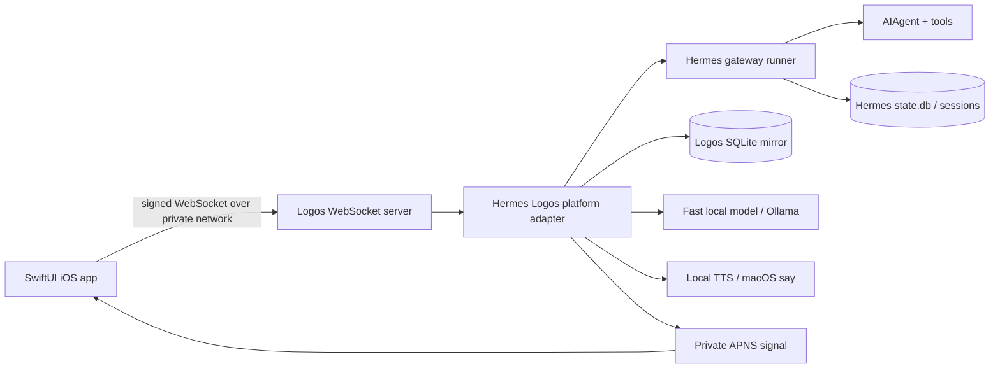
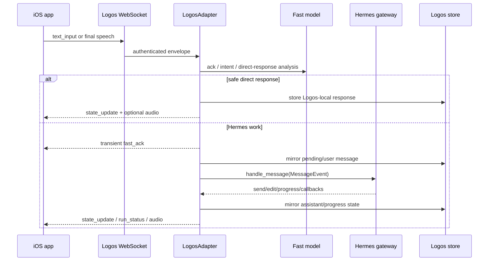
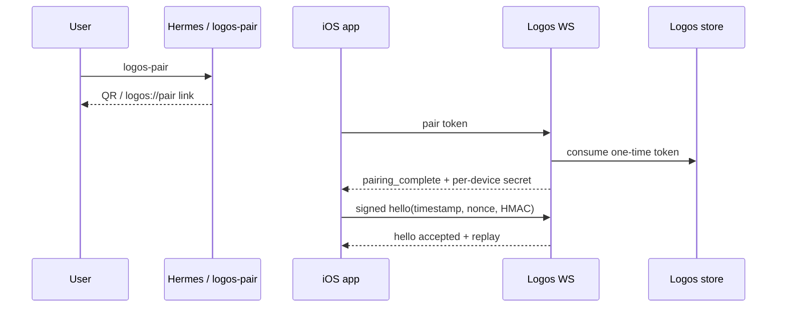
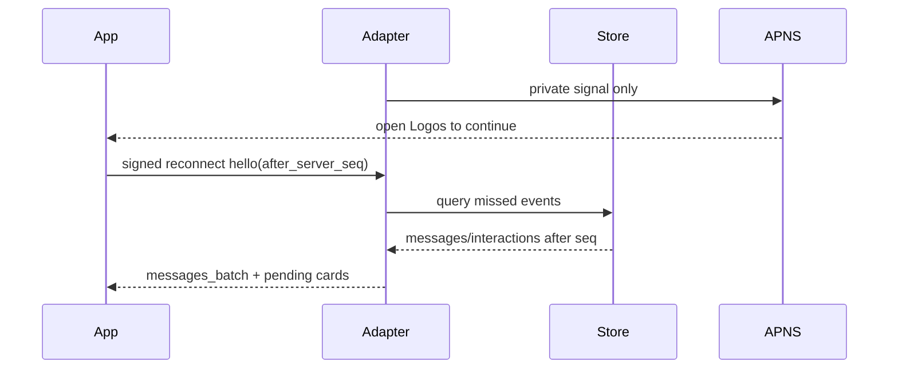
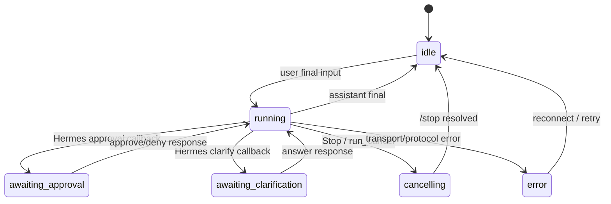
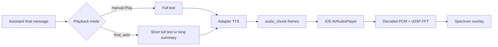

# Logos Contributor README Documentation Update Plan

> **For Hermes:** This is a documentation-only plan. Do not implement until Ryan approves it.

**Goal:** Replace the thin root `README.md` with a contributor-grade guide that explains what Logos is, how the Mac plugin and iOS app work together, how to develop/test it safely, and where the project is headed.

**Architecture:** The README should be the contributor landing page, not the full design archive. It should summarize the live implementation, link to deeper docs, explicitly label historical/stale docs, and embed maintainable diagrams directly in Markdown where practical.

**Tech Stack:** Hermes Agent platform plugin, Python `websockets` adapter, SQLite mirror store, HMAC-authenticated WebSocket protocol, SwiftUI iOS client, XcodeGen, URLSessionWebSocketTask, SFSpeechRecognizer/AVFoundation, APNS, local fast LLM/Ollama, local TTS/macOS `say`.

---

## 0. Planning constraints and current repo state

- This task is documentation-only.
- Do not touch implementation files.
- Do not commit, push, run formatters, regenerate Xcode projects, or start long-lived services during planning.
- The current working tree is already dirty with unrelated changes on branch `codex/conversation-auto-follow`:
  - `clients/ios/Logos/Logos/ContentView.swift`
  - `clients/ios/Logos/LogosUITests/LogosUITests.swift`
  - `clients/ios/Logos/project.yml`
  - `scripts/run_stage_f_mock_adapter.py`
- The README update must avoid overwriting those unrelated changes.
- If implementation proceeds on the current branch, stage only documentation files.

---

## 1. Research summary

### 1.1 Current README state

`README.md` is only 42 lines. It contains:

- One-sentence product summary.
- Repository map.
- Outdated/underspecified status.
- Python validation command.
- iOS validation command.
- One UI-test mock-adapter note.

It is not enough for external contributors. It does not explain the trust model, plugin lifecycle, protocol, iOS architecture, pairing, live-vs-mock testing, current roadmap, or which existing docs are historical.

### 1.2 Original design source

The original design source is:

- `docs/logos/reference/logos-architecture-v2.2.md`
- `docs/logos/reference/logos-agent-autonomous-handoff-prompt-v2.md`

Core intent from those docs:

- Logos is a private iPhone voice-and-tap surface for Hermes Agent.
- Logos is a Hermes platform plugin, not a Hermes core fork.
- Final text/speech routes through normal Hermes `MessageEvent` / `handle_message(...)` gateway semantics.
- The iPhone mirrors state; it does not author Hermes `state.db` directly.
- Foreground WebSocket is the live path; APNS is a private attention/reconnect signal.
- Continuity is explicit through projects, `/resume`, memory, Hindsight, and Kanban — not implicit desktop/phone focus sync.
- Fast local model is for acknowledgments, safe direct micro-responses, narrow intents, and summaries only.
- TTS/audio is request-scoped and adapter-owned.
- Apple Watch, public server, multi-user support, durable run recovery, and persistent approval policies are deferred/non-goals.

### 1.3 Actual Mac/plugin implementation

Key files:

- `plugins/logos/plugin.yaml` — Hermes plugin manifest.
- `plugins/logos/__init__.py` — plugin registration entry.
- `plugins/logos/adapter.py` — Hermes platform adapter and gateway bridge.
- `plugins/logos/ws_server.py` — authenticated WebSocket server.
- `plugins/logos/schema.py` — envelope/protocol schema and redaction helpers.
- `plugins/logos/store.py` — Logos SQLite mirror store.
- `plugins/logos/pairing.py` — QR/deep-link pairing and device-secret derivation.
- `plugins/logos/apns.py` — private APNS payload and token-auth send path.
- `plugins/logos/fast_llm.py` — deterministic fallback plus Ollama-backed fast model.
- `plugins/logos/tts.py` — deterministic WAV stub plus macOS `say` TTS.

Important actual behavior:

- Default WebSocket host/port is `127.0.0.1:8765` unless config/env overrides.
- Pre-auth server accepts only `pair` and signed `hello`.
- Signed hello uses HMAC-SHA256 over `logos-v1`, device id, request id, project key, timestamp, and nonce.
- Plaintext legacy `payload.secret` hello is rejected.
- `pair` consumes a short-lived one-time token and returns a per-device secret derived from the master secret.
- Final text/speech goes through `_handle_final_text` → fast model analysis → either safe direct response or `_dispatch_gateway_text` → `self.handle_message(MessageEvent(...))`.
- Gateway callbacks/output return through `send`, `edit_message`, `send_exec_approval`, and `send_clarify`.
- Store tables include messages, projects, device pointers, summaries, devices, pairing tokens, pending interactions, and event sequence.
- APNS payloads are private by construction.
- Live smoke exists at `scripts/logos_live_smoke.py`.
- Mock adapter exists at `scripts/run_stage_f_mock_adapter.py` and is used by UI tests.

### 1.4 Actual iOS implementation

Key files:

- `clients/ios/Logos/project.yml` — XcodeGen spec.
- `clients/ios/Logos/Logos/LogosApp.swift` — app entry and APNS delegate bridge.
- `clients/ios/Logos/Logos/ContentView.swift` — main SwiftUI surface.
- `clients/ios/Logos/Logos/LogosClient.swift` — WebSocket, protocol, state, run, message, cards, playback lifecycle.
- `clients/ios/Logos/Logos/LogosModels.swift` — models, settings, HMAC hello, pairing routes, pending-message reconciliation.
- `clients/ios/Logos/Logos/SQLiteMessageStore.swift` — local message cache.
- `clients/ios/Logos/Logos/VoiceInputStateMachine.swift` — testable voice/ASR policy.
- `clients/ios/Logos/Logos/VoiceInputController.swift` — SFSpeechRecognizer / AVAudioEngine controller.
- `clients/ios/Logos/Logos/AudioPlaybackController.swift` — chunk assembly, playback lifecycle, async sample decode.
- `clients/ios/Logos/Logos/AudioSpectrumAnalyzer.swift` — vDSP FFT spectrum analyzer.
- `clients/ios/Logos/Logos/NotificationCoordinator.swift` — APNS/deep-link route handling.
- `clients/ios/Logos/Logos/ProjectSwitcherLayout.swift` — deterministic picker layout.

Actual iOS features:

- SwiftUI app with dark chat surface.
- Signed WebSocket hello and stale-callback generation gating.
- Local SQLite message cache in Application Support.
- Text composer.
- Project picker/create/switch.
- Run status, stop/cancel, progress aggregation.
- Approval and clarification cards.
- Push notification route handling.
- Pairing deep links via `logos://pair#...`.
- Hold-to-talk and tap-to-talk, local-only/on-device ASR policy, finalization timeout/fallback behavior.
- Immediate pending bubble after final ASR send acceptance.
- Audio playback overlay, manual/final-auto playback, chunk validation, and real FFT spectrum.
- UI test accessibility identifiers.

Likely partial/stub surfaces to label honestly:

- Attachment sheet rows are UI stubs.
- Apple Watch is deferred.
- Always-listening/wake-word behavior is not a v1 implemented contract.
- Some settings are local preferences unless/until backend integration says otherwise.

### 1.5 Current docs drift / contradictions

The README update should not blindly copy old stage docs. It should flag and route around drift:

- `README.md` says simulator-verifiable implementation is complete, but latest final/test reports say the live Hermes plugin path has also been validated.
- `FINAL_REPORT.md` / `TEST_REPORT.md` say physical/manual validation remains Ryan-owned after handoff.
- `DEVICE_TEST_CHECKLIST.md` and older notes contain language implying physical/manual gate was accepted without a full captured report. README should avoid overclaiming and say hardware validation should be rerun/recorded before production use.
- `LOGOS_PROTOCOL.md` still includes a stale plaintext `payload.secret` hello example; actual code rejects plaintext legacy hello.
- Stage docs contain old test counts and mock-only caveats.
- `IOS_SIMULATOR_STAGE_F.md` uses mock port `8765`; current UI tests default to `8766`.
- `RUN_INTERACTIONS.md` shows `session_key` in approval payload; current code strips it before broadcasting.
- `schema.py` lists `heartbeat` / `heartbeat_ack`, but the adapter does not appear to implement heartbeat handling. README should avoid promising heartbeat behavior unless implementation is verified/updated separately.

---

## 2. Recommended README strategy

### 2.1 Keep README as the contributor landing page

The README should answer:

1. What is Logos?
2. What works today?
3. What are the major pieces?
4. How do I run tests locally?
5. How do I run the iOS app against the mock adapter?
6. How do I validate live Hermes plugin behavior?
7. What should I avoid changing?
8. Where are deeper docs?
9. What future work is planned?

It should not attempt to replace every detailed doc. It should link to them with labels like:

- “Current status reports”
- “Original architecture/reference”
- “Historical stage docs”
- “Feature plans/backlog”
- “Physical device guide”

### 2.2 Prefer Mermaid diagrams first

Recommendation: embed diagrams as Mermaid Markdown blocks directly in `README.md`.

Why:

- GitHub renders Mermaid natively.
- No binary assets to maintain.
- Contributors can edit diagrams in normal PRs.
- Review diffs stay readable.

Optional follow-up if Ryan wants polished visuals:

- Add curated SVG diagrams under `docs/logos/assets/readme/` generated from the Mermaid or hand-authored as SVG.
- Link/embed those SVGs from README.
- Do this only if Mermaid rendering is insufficient. Otherwise it is documentation ceremony. Pretty, but still ceremony.

### 2.3 Scope of the first documentation PR

Primary file:

- Modify `README.md` extensively.

Optional doc-only supporting files if approved:

- `docs/logos/assets/readme/` for SVG diagrams, only if choosing image assets.
- Maybe `docs/logos/README.md` as a docs index, but only if the root README becomes too large. For this task, keep the plan centered on root README.

No implementation files should change.

---

## 3. Proposed README outline

### 3.1 Title and one-screen summary

Add:

```markdown
# Logos

Logos is a private iPhone voice-and-tap client for Hermes Agent. It lets a single user send text or speech from iOS to a Mac-hosted Hermes profile, receive live run/progress updates, answer approvals/clarifications, and play back responses over a private network.
```

Include a short “status badges without badges” block:

```markdown
Current state:
- Mac plugin + WebSocket adapter: implemented and live-smoke validated.
- iOS SwiftUI client: implemented and simulator-tested.
- Voice/ASR: implemented with local-only recognition policy; physical device reruns required for real microphone behavior.
- APNS: private payload scaffolding implemented; live delivery requires Apple signing/APNS credentials and physical device validation.
- Apple Watch: deferred.
```

### 3.2 Big warning: private/personal architecture

Add a prominent section:

```markdown
> Logos is currently designed for one trusted user, one Mac, one Hermes profile, and a private network/Tailscale boundary. It is not a public multi-user service.
```

Explain:

- Do not expose the WebSocket to the public internet.
- Keep APNS payloads private.
- Do not commit/log device secrets, APNS keys, Tailscale hostnames if sensitive, transcripts with secrets, or approval command bodies.

### 3.3 Architecture overview

Embed a system topology diagram:



Then explain each component in prose.

### 3.4 Repository map

Expand current repo map:

```markdown
plugins/logos/                 Mac-side Hermes plugin and WebSocket adapter
clients/ios/Logos/             SwiftUI iOS app, XcodeGen project
tests/                         Python protocol/plugin tests
scripts/                       mock adapter, live smoke, WebSocket helpers
docs/logos/                    reports, protocol refs, physical test guides
.hermes/plans/                 implementation/feature plans and historical roadmap
```

Add a table with key files and what to read first.

### 3.5 Core runtime flows

Add subsections with diagrams.

#### Flow A: final text/speech to Hermes



Call out:

- Final speech is visible immediately as a pending user bubble.
- Fast ack is transient and not a conversation turn.
- Substantive work goes through Hermes.

#### Flow B: pairing and signed auth



Note plaintext secret auth is legacy/rejected.

#### Flow C: reconnect/replay



#### Flow D: approval/clarification



#### Flow E: audio playback and spectrum



### 3.6 Setup prerequisites

Document:

- macOS with Hermes Agent installed.
- Python environment: use Hermes venv where possible.
- Xcode + XcodeGen for iOS.
- iOS simulator.
- Private network/Tailscale for physical device use.
- Required/optional env/config.

Suggested env/config table:

| Name | Required? | Used by | Notes |
|---|---:|---|---|
| `LOGOS_DEVICE_SECRET` | yes/dev | plugin + tests | Master/device secret; never commit. |
| `LOGOS_HOST` / `LOGOS_PORT` | optional | plugin | Default local server bind. |
| `LOGOS_PUBLIC_URL` | physical pairing | pairing | Must be reachable from iPhone, preferably WSS. |
| `LOGOS_STORE_PATH` | optional/tests | plugin | Override SQLite mirror path. |
| `LOGOS_FAST_MODEL_PROVIDER` | optional | plugin | `deterministic` or `ollama`. |
| `LOGOS_TTS_PROVIDER` | optional | plugin | `deterministic` or `macos_say`. |
| APNS vars | optional | plugin | Required for live push delivery only. |
| `LOGOS_UI_TEST_WS_URL` | UI tests | iOS tests | Defaults to mock adapter URL. |
| `LOGOS_UI_TEST_DEVICE_SECRET` | UI tests | iOS tests | Test-only secret. |
| `LOGOS_MESSAGE_STORE_FILENAME` | tests | iOS app | Isolates local SQLite store. |

### 3.7 Local development workflows

Add exact workflows.

#### Python tests

```bash
cd /Users/ryan/Development/logos
PYTHONPATH=/Users/ryan/Development/logos/plugins:/Users/ryan/.hermes/hermes-agent \
  /Users/ryan/.hermes/hermes-agent/venv/bin/pytest -q tests
```

#### Python compile check

```bash
cd /Users/ryan/Development/logos
PYTHONPATH=/Users/ryan/Development/logos/plugins:/Users/ryan/.hermes/hermes-agent \
  /Users/ryan/.hermes/hermes-agent/venv/bin/python -m compileall -q plugins/logos scripts tests
```

#### iOS project generation

```bash
cd /Users/ryan/Development/logos/clients/ios/Logos
xcodegen generate --spec project.yml
```

#### iOS unit tests

```bash
cd /Users/ryan/Development/logos/clients/ios/Logos
xcodebuild -project Logos.xcodeproj \
  -scheme Logos \
  -destination 'platform=iOS Simulator,id=FD91D719-6C01-4917-A654-B81D3465595A' \
  -only-testing:LogosTests \
  test
```

#### Mock adapter for UI tests

```bash
cd /Users/ryan/Development/logos
PYTHONPATH=/Users/ryan/Development/logos/plugins:/Users/ryan/.hermes/hermes-agent \
  /Users/ryan/.hermes/hermes-agent/venv/bin/python \
  scripts/run_stage_f_mock_adapter.py \
  --host 127.0.0.1 \
  --port 8766 \
  --secret stage-f-secret \
  --store /tmp/logos-ui-tests.db
```

#### iOS UI tests

```bash
cd /Users/ryan/Development/logos/clients/ios/Logos
LOGOS_UI_TEST_WS_URL=ws://127.0.0.1:8766 \
LOGOS_UI_TEST_DEVICE_SECRET=stage-f-secret \
xcodebuild -project Logos.xcodeproj \
  -scheme Logos \
  -destination 'platform=iOS Simulator,id=FD91D719-6C01-4917-A654-B81D3465595A' \
  -only-testing:LogosUITests \
  test
```

#### Live plugin smoke

```bash
cd /Users/ryan/Development/logos
python scripts/logos_live_smoke.py --scenario all --timeout 360
```

Add note: live smoke uses real configured Logos gateway/plugin; mock adapter tests do not prove live Hermes behavior.

### 3.8 Validation ladder

Add table:

| Gate | Proves | Does not prove |
|---|---|---|
| Python tests | protocol/store/plugin logic | iOS UI, physical network |
| iOS unit tests | client state machines, parser, store, voice/audio policy | live WebSocket, hardware mic |
| iOS UI + mock adapter | SwiftUI flow against deterministic protocol server | real Hermes gateway/tool callbacks |
| live smoke | real Hermes plugin/gateway path | physical iPhone/APNS/hardware behavior |
| physical guide | device install, Tailscale/WSS, mic, speaker, APNS | multi-user/public production readiness |

### 3.9 Contributor guardrails

Add bullets:

- Do not patch Hermes core unless explicitly approved and documented.
- Keep plugin source under `plugins/logos/`; runtime install/symlink is deployment detail.
- Route user input through gateway `handle_message(...)`.
- Do not write Hermes `state.db` directly from the phone.
- Treat project/session docs as single-user/private trust assumptions.
- Never commit secrets or raw APNS keys/device secrets.
- Private APNS payloads only; no response text or command previews in pushes.
- Keep fast-model direct responses narrow and safe.
- Prefer mock adapter for deterministic UI tests and live smoke for integration truth.

### 3.10 Current status and roadmap

Use a careful current-status block:

```markdown
As of the latest reports and recent fixes:
- Live plugin/gateway path has been smoke-tested.
- iOS unit/UI test coverage exists for major client state machines.
- Voice, playback, progress, request cancellation, and ASR pending-bubble lifecycle have been hardened with regressions.
- Physical iPhone/APNS/hardware behavior should be rerun and recorded before production claims.
```

Roadmap groups:

**Near-term docs/quality**

- Canonicalize protocol docs around signed hello/pairing.
- Update stale test counts/status docs.
- Add a docs index under `docs/logos/` if README becomes too large.

**Product hardening**

- Physical iPhone validation report refresh.
- APNS credential/live delivery validation.
- Tailscale/WSS setup docs with current `tailscale serve --tls-terminated-tcp` pattern.
- Attachment UI implementation or explicit removal/stubbing.

**Future features**

- Apple Watch relay after iPhone reliability.
- Richer project/session search.
- Multi-device project sharing only after auth model review.
- Higher-naturalness TTS provider swap.
- More robust local fast-model eval set.
- Durable run recovery after adapter restart, if ever needed.

**Out of scope for now**

- Public service deployment.
- Multi-user auth model.
- Continuous listening.
- Persistent approval policy UX.
- Logos Kanban editor UI.

### 3.11 Docs map

Add a “Where to read more” table:

| Document | Use for | Status |
|---|---|---|
| `docs/logos/FINAL_REPORT.md` | latest architecture/status handoff | mostly current but verify recent PRs |
| `docs/logos/TEST_REPORT.md` | validation evidence | historical snapshot |
| `docs/logos/LOGOS_PHYSICAL_DEVICE_TEST_GUIDE.html` | manual hardware runbook | use for reruns |
| `docs/logos/reference/logos-architecture-v2.2.md` | original design intent | design source, not implementation truth |
| `docs/logos/reference/logos-agent-autonomous-handoff-prompt-v2.md` | original implementation contract | historical/reference |
| `docs/logos/LOGOS_PROTOCOL.md` | protocol background | needs refresh; examples may be stale |
| `docs/logos/PROJECT_ROUTING.md` | project/session routing | useful but stage-era |
| `docs/logos/RUN_INTERACTIONS.md` | approval/clarify/run semantics | useful but stage-era |
| `.hermes/plans/*.md` | feature plans and roadmap | implementation-planning artifacts |

---

## 4. Implementation task plan after approval

### Task 1: Create a README skeleton with anchors

**Objective:** Replace the terse README with a structured contributor landing page without filling every section yet.

**Files:**

- Modify: `README.md`

**Steps:**

1. Preserve the title and short product description.
2. Add table of contents.
3. Add placeholder sections from the outline above.
4. Keep old validation commands temporarily under the new validation section.
5. Run Markdown check by viewing the diff; no code tests required yet.

**Verification:**

```bash
git diff -- README.md
```

Check that no implementation files changed.

### Task 2: Add architecture overview and Mermaid topology diagram

**Objective:** Give new contributors the system mental model in the first few screens.

**Files:**

- Modify: `README.md`

**Steps:**

1. Add the private/personal architecture warning.
2. Add topology Mermaid diagram.
3. Add component explanations for iOS app, WebSocket server, adapter, Hermes gateway, store, fast model, TTS, APNS.
4. Link to original architecture reference.

**Verification:**

- Render README in GitHub preview or local Markdown preview.
- Confirm Mermaid syntax is fenced as `mermaid`.

### Task 3: Add repository map and key-file reading path

**Objective:** Help contributors choose the right file quickly.

**Files:**

- Modify: `README.md`

**Steps:**

1. Add repo directory table.
2. Add Mac-side key files table.
3. Add iOS key files table.
4. Add scripts/tests/docs table.

**Verification:**

```bash
python - <<'PY'
from pathlib import Path
for p in [
  'plugins/logos/adapter.py',
  'plugins/logos/ws_server.py',
  'plugins/logos/store.py',
  'clients/ios/Logos/Logos/LogosClient.swift',
  'clients/ios/Logos/Logos/ContentView.swift',
  'scripts/run_stage_f_mock_adapter.py',
  'scripts/logos_live_smoke.py',
]:
  assert Path(p).exists(), p
print('README referenced key paths exist')
PY
```

### Task 4: Add runtime flow diagrams

**Objective:** Explain the flows contributors are most likely to break.

**Files:**

- Modify: `README.md`

**Diagrams to add:**

1. Text/speech → fast ack/direct/Hermes flow.
2. Pairing and signed hello flow.
3. Reconnect/replay + APNS flow.
4. Approval/clarification/run state machine.
5. Audio playback/spectrum pipeline.

**Verification:**

- Check Mermaid syntax visually or with a Mermaid preview if available.
- Ensure diagrams do not include secrets, real hostnames, or tokens.

### Task 5: Add setup and configuration section

**Objective:** Make local development reproducible without exposing secrets.

**Files:**

- Modify: `README.md`

**Steps:**

1. Add prerequisites.
2. Add env/config matrix.
3. Document secret-handling rules.
4. Document plugin install/enable concepts without assuming every contributor has Ryan’s local Hermes paths.
5. Keep Ryan-local commands as examples where this repo currently uses them, but label them as local-dev examples.

**Verification:**

- Secret scan added README lines manually; ensure no raw secret values.

### Task 6: Add development workflows and validation ladder

**Objective:** Give contributors the exact commands and explain what each gate proves.

**Files:**

- Modify: `README.md`

**Steps:**

1. Add Python test command.
2. Add Python compile command.
3. Add XcodeGen command.
4. Add iOS unit test command.
5. Add mock adapter command on `8766`.
6. Add UI test command.
7. Add live smoke command.
8. Add validation ladder table.

**Verification:**

- Do not run expensive tests as part of docs implementation unless requested.
- At minimum verify commands are syntactically copyable and paths exist.

### Task 7: Add current status, known limitations, and roadmap

**Objective:** Prevent contributors from mistaking historical docs for current truth.

**Files:**

- Modify: `README.md`

**Steps:**

1. Add conservative current-status section.
2. Link latest reports.
3. Explicitly call out physical validation needs.
4. Add implemented/stub/deferred feature table.
5. Add near-term roadmap and long-term deferred work.

**Verification:**

- Check status claims against `FINAL_REPORT.md`, `TEST_REPORT.md`, current code, and recent PR work.
- Avoid overclaiming production readiness.

### Task 8: Add docs map and staleness notes

**Objective:** Make the existing docs useful instead of confusing.

**Files:**

- Modify: `README.md`

**Steps:**

1. Add “Where to read more” table.
2. Label original architecture as design intent.
3. Label stage docs as historical/stage-era.
4. Identify docs that need future refresh.
5. Link `.hermes/plans` as feature-plan archive.

**Verification:**

- Confirm every linked file exists.
- Check no old status is presented as latest if contradicted.

### Task 9: Optional image/SVG pass if Mermaid is not enough

**Objective:** Add polished visual assets only if they justify their maintenance cost.

**Files:**

- Optional create: `docs/logos/assets/readme/logos-topology.svg`
- Optional create: `docs/logos/assets/readme/logos-message-flow.svg`
- Modify: `README.md`

**Recommendation:** Skip on first pass unless Ryan explicitly wants image assets. Mermaid is likely enough and is easier to maintain.

**Verification if used:**

- SVGs contain no external scripts.
- SVGs are readable in GitHub preview.
- README still has alt text.

### Task 10: Documentation hygiene review

**Objective:** Verify the README update is useful and safe.

**Files:**

- Modify: `README.md`
- Optional assets under `docs/logos/assets/readme/`

**Checks:**

```bash
git diff --check
git diff -- README.md
```

Manual review checklist:

- [ ] New contributor can explain what Logos is after first screen.
- [ ] Architecture diagrams render.
- [ ] Setup commands are copyable.
- [ ] Mock vs live tests are clearly distinguished.
- [ ] Physical-device limitations are not hidden.
- [ ] Historical docs are labeled.
- [ ] No secrets, tokens, raw APNS keys, or real private credentials appear.
- [ ] Only documentation files changed.

---

## 5. Risks and tradeoffs

### Risk: README becomes too large

This update will be substantial. A long README is acceptable if it is navigable, but if it becomes unwieldy, split supporting detail into `docs/logos/README.md` or a `CONTRIBUTING.md` follow-up.

Recommendation for first pass: keep one comprehensive README with a strong table of contents.

### Risk: Mermaid diagrams may not render everywhere

GitHub supports Mermaid, but some local Markdown viewers do not.

Recommendation: use Mermaid anyway for maintainability. Add brief prose summaries before each diagram so the README remains understandable without rendered diagrams.

### Risk: stale stage docs confuse contributors

The repo has useful but stale stage-era docs.

Recommendation: README should explicitly label stage docs as historical and current implementation/tests as operational truth.

### Risk: overclaiming physical validation

Docs conflict on physical gate status.

Recommendation: say automated/live-plugin gates pass, and physical iPhone/APNS/hardware validation should be rerun and recorded before production claims. Boring truth beats shiny fiction.

### Risk: local Ryan-specific paths reduce contributor portability

The repo currently uses Ryan-local Hermes paths in commands.

Recommendation: show Ryan-local commands as current repo examples, but add placeholders and notes for contributors to adapt `HERMES_HOME`, Hermes venv, simulator ID, and endpoint URLs.

---

## 6. Open questions for Ryan before implementation

1. Should the README be a single large contributor guide, or should I also create `docs/logos/README.md` / `CONTRIBUTING.md` and keep root README shorter?
2. Do you want Mermaid-only diagrams, or should I create polished SVG image assets under `docs/logos/assets/readme/`?
3. How should we phrase physical validation status?
   - Conservative recommendation: “Automated/live plugin gates pass; physical iPhone/APNS/hardware validation guide exists and should be rerun/recorded before production use.”
4. Should the README mention the current default physical endpoint (`wss://studio...`) at all, or keep endpoint examples generic to avoid leaking private topology?
5. Should we update stale docs such as `LOGOS_PROTOCOL.md` in this same documentation-only effort, or keep the first PR focused strictly on root `README.md`?

---

## 7. Recommended answer to the open questions

My recommendation:

1. Start with root `README.md` only. If it becomes too large after review, split later.
2. Use Mermaid diagrams first. Do not add SVG assets unless you specifically want a more polished visual pass.
3. Use conservative physical-validation wording. The repo has conflicting docs; overclaiming here would be sloppy.
4. Keep endpoint examples generic, with `127.0.0.1`, `wss://<mac>.<tailnet>.ts.net/`, and placeholders.
5. Do not update stale stage docs in the first pass. Instead, label them in README and create a future docs-refresh backlog item.

---

## 8. Acceptance criteria for the README update

The documentation update is complete when:

- `README.md` explains Logos in contributor-friendly terms.
- It contains architecture and flow diagrams.
- It distinguishes mock adapter tests from live Hermes plugin smoke tests.
- It contains copyable local development/test commands.
- It documents trust/security constraints.
- It labels current, historical, and future documentation clearly.
- It includes current roadmap/non-goals.
- It does not modify non-doc implementation files.
- `git diff --check` passes.
- A final review confirms no secrets and no false production-readiness claims.
