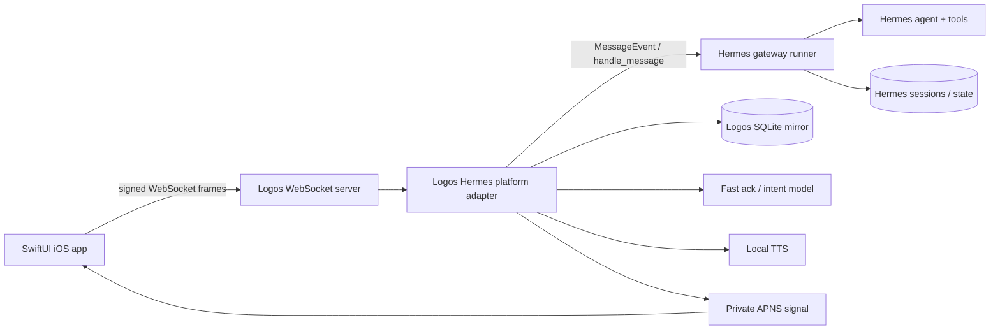
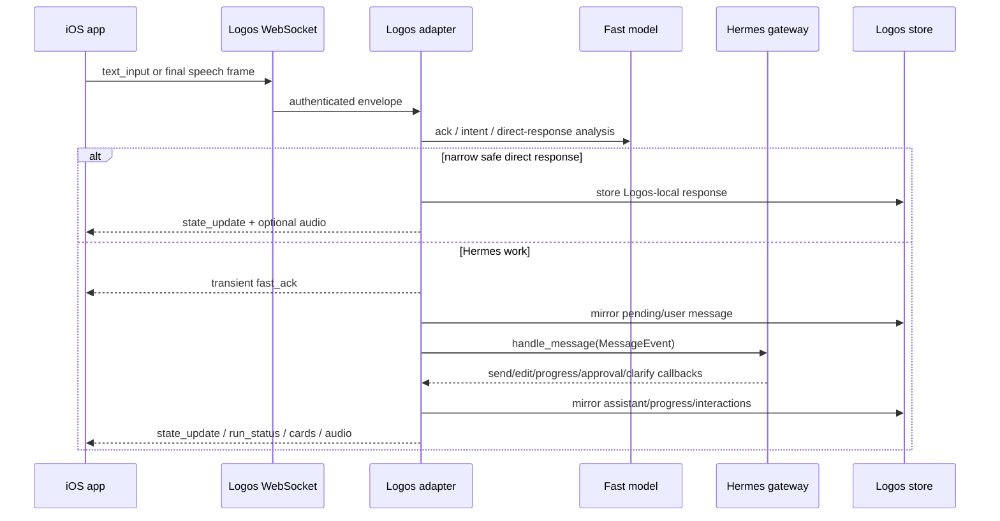
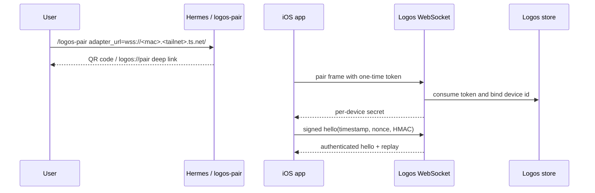
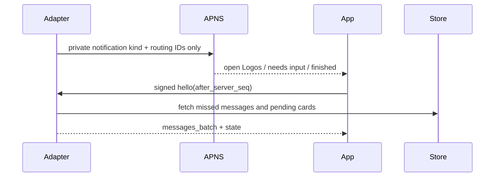

# Logos

Logos is an iPhone voice-and-tap client for [Hermes Agent](https://github.com/NousResearch/hermes-agent). It lets a mobile user send text or speech to a Mac-hosted Hermes gateway, watch run/progress updates, answer approvals and clarifications, and play back assistant responses over a private network.

This repo contains both sides of that bridge:

- `plugins/logos/` — Hermes platform plugin and authenticated WebSocket adapter.
- `clients/ios/Logos/` — SwiftUI iOS client generated with XcodeGen.
- `scripts/` — mock adapter, live smoke tests, and WebSocket helper clients.
- `tests/` — Python adapter/protocol tests.
- `docs/logos/` — protocol notes, test reports, implementation notes, and hardware validation runbooks.

> **Security model:** Logos is a private-network client, not a public multi-user service. Keep the adapter bound to loopback when possible, expose it to phones through Tailscale/WSS, never commit device secrets or APNS keys, and do not put assistant text or approval command bodies into push notifications.

## Table of contents

1. [Architecture](#architecture)
2. [What works today](#what-works-today)
3. [Repository map](#repository-map)
4. [Prerequisites](#prerequisites)
5. [Environment variables](#environment-variables)
6. [Quick start: mock adapter + iOS Simulator](#quick-start-mock-adapter--ios-simulator)
7. [Install the Hermes adapter](#install-the-hermes-adapter)
8. [Run the live Hermes gateway path](#run-the-live-hermes-gateway-path)
9. [Tailscale setup for physical iPhone](#tailscale-setup-for-physical-iphone)
10. [Pair and launch the iOS app from Xcode](#pair-and-launch-the-ios-app-from-xcode)
11. [Validation ladder](#validation-ladder)
12. [Development commands](#development-commands)
13. [APNS setup](#apns-setup)
14. [Troubleshooting](#troubleshooting)
15. [Contributor guardrails](#contributor-guardrails)

## Architecture

Logos keeps Hermes as the agent authority. The iOS app does not construct an agent or edit Hermes session storage directly; it sends authenticated protocol frames to the adapter, and the adapter routes real user input through Hermes gateway platform semantics.



Core flows:



Pairing uses short-lived QR/deep-link tokens. The QR does **not** contain a long-lived device secret.



The iOS app may be suspended in the background. APNS is only a private attention signal; reconnect and delta-sync are the source of truth.



## What works today

Implemented:

- Hermes platform plugin registration (`kind: platform`).
- Authenticated WebSocket server with signed HMAC `hello` frames.
- QR/deep-link pairing with per-device secret derivation.
- Text input, speech-final input, run cancellation, approval cards, clarification cards, progress updates, message replay, project switching, and project creation.
- SwiftUI iOS app with local SQLite message cache, WebSocket lifecycle gating, text composer, tap-to-talk, hold-to-talk, on-device speech-recognition policy, playback controls, and FFT-based spectrum visualization.
- Deterministic mock adapter for simulator UI tests.
- Live smoke script for the real Hermes gateway/plugin path.
- Optional private APNS payload construction.

Requires environment-specific validation:

- Physical iPhone install/signing.
- Tailscale/WSS reachability from the phone.
- Microphone and speech-recognition behavior on real hardware.
- APNS credentials and live push delivery.
- Any production-grade multi-user or public-network hardening. That is intentionally out of scope for the current architecture.

## Repository map

```text
plugins/logos/
  plugin.yaml                 Hermes plugin manifest
  __init__.py                 plugin entrypoint
  adapter.py                  Hermes platform adapter and gateway bridge
  ws_server.py                authenticated WebSocket server
  schema.py                   protocol envelope validation
  store.py                    adapter-owned SQLite mirror store
  pairing.py                  QR/deep-link pairing and per-device secret derivation
  apns.py                     private APNS payload/client
  fast_llm.py                 fast ack/intent/direct-response layer
  tts.py                      deterministic WAV stub + macOS say TTS

clients/ios/Logos/
  project.yml                 XcodeGen source of truth
  Logos/                      SwiftUI app source
  LogosTests/                 iOS unit tests
  LogosUITests/               iOS UI tests

scripts/
  run_stage_f_mock_adapter.py deterministic Hermes-like adapter for simulator tests
  logos_live_smoke.py         real Hermes plugin/gateway smoke tests
  logos_ws_client.py          minimal signed WebSocket CLI client

tests/                        Python adapter/protocol/store tests
docs/logos/                   deeper reports and reference docs
```

Generated Xcode files are ignored. Regenerate `clients/ios/Logos/Logos.xcodeproj` from `project.yml`.

## Prerequisites

### Mac

- macOS with full Xcode installed and selected.
- Hermes Agent installed, configured with at least one working model/provider, and reachable as `hermes` on `PATH`.
- Python environment that can import Hermes source modules.
- XcodeGen.
- Tailscale for physical iPhone testing.

Recommended checks:

```bash
xcode-select -p
xcodebuild -version
xcodebuild -showsdks | grep -E 'iphoneos|iphonesimulator'
xcrun simctl list runtimes | grep iOS
hermes doctor
hermes gateway status || true
```

Install XcodeGen if needed:

```bash
brew install xcodegen
xcodegen --version
```

### iPhone

- iOS device signed into the same Tailscale tailnet as the Mac.
- Developer Mode enabled for Xcode deployment.
- A signing team selected in Xcode.
- Camera access or another way to open `logos://pair#...` deep links.

### Optional

- Ollama or another local model endpoint for the fast ack/intent layer.
- APNS Auth Key for push notifications.
- A preferred macOS `say` voice for local TTS.

## Environment variables

The adapter reads configuration from Hermes platform config and environment variables. Secrets should live in Hermes' `.env`, not in this repository.

| Variable | Required | Used by | Notes |
|---|---:|---|---|
| `LOGOS_DEVICE_SECRET` | Yes | adapter, live tests | Master secret used to derive per-device secrets. Generate with `openssl rand -hex 32`. Never commit. |
| `LOGOS_HOST` | No | adapter | Bind host. Prefer `127.0.0.1` and expose through Tailscale Serve. Default: `127.0.0.1`. |
| `LOGOS_PORT` | No | adapter | Bind port. Default: `8765`. |
| `LOGOS_PUBLIC_URL` | Physical device | pairing | Public-to-phone adapter URL, normally `wss://<mac-hostname>.<tailnet-name>.ts.net/`. |
| `LOGOS_STORE_PATH` | No | adapter/tests | SQLite mirror-store path override. |
| `LOGOS_TIMEOUT_SECONDS` | No | adapter/app | Stale-silence threshold sent to the iOS app as `client_config.stale_timeout_seconds`. Default: `900`; config fallback: `platforms.logos.extra.timeout_seconds`. |
| `LOGOS_ALLOWED_USERS` | No | gateway auth | Comma-separated device IDs allowed through gateway auth. QR-paired devices are also bridged into Hermes gateway authorization. |
| `LOGOS_ALLOW_ALL_USERS` | Dev only | gateway auth | Allow any authenticated device ID. Useful only for local throwaway testing. |
| `LOGOS_FAST_MODEL_PROVIDER` | No | fast model | `deterministic` or `ollama`. |
| `LOGOS_FAST_MODEL_ENDPOINT` | No | fast model | Ollama-compatible endpoint. Default: `http://127.0.0.1:11434`. |
| `LOGOS_FAST_MODEL_MODEL` | No | fast model | Local model name when using Ollama. |
| `LOGOS_TTS_PROVIDER` | No | TTS | `deterministic` or `macos_say`. |
| `LOGOS_TTS_VOICE` | No | TTS | macOS `say` voice name. |
| `LOGOS_APNS_KEY_ID` | APNS | push | Apple key ID. |
| `LOGOS_APNS_TEAM_ID` | APNS | push | Apple Developer Team ID. |
| `LOGOS_APNS_BUNDLE_ID` | APNS | push | iOS bundle identifier / APNS topic. |
| `LOGOS_APNS_AUTH_KEY_PATH` | APNS | push | Path to `.p8` Auth Key, outside the repo. |
| `LOGOS_APNS_ENV` | APNS | push | `sandbox` for development, `production` for App Store/TestFlight. |
| `LOGOS_WS_URL` | iOS launch env | app | Override adapter URL in Xcode scheme/tests. |
| `LOGOS_DEVICE_ID` | iOS launch env | app | Override device ID in Xcode scheme/tests. |
| `LOGOS_AUTOCONNECT` | iOS launch env | app/tests | `1`/`true` bypasses first-connection gate for test launches. |
| `LOGOS_MESSAGE_STORE_FILENAME` | iOS launch env | app/tests | Isolates simulator SQLite stores. |

## Quick start: mock adapter + iOS Simulator

This path proves the iOS app and protocol UI without requiring a live Hermes gateway. It intentionally does **not** prove real Hermes agent behavior.

From the repo root:

```bash
export REPO_ROOT="$(pwd)"
export HERMES_SRC="${HERMES_SRC:-$HOME/.hermes/hermes-agent}"
export HERMES_PYTHON="${HERMES_PYTHON:-$HERMES_SRC/venv/bin/python}"
export PYTHONPATH="$REPO_ROOT/plugins:$HERMES_SRC${PYTHONPATH:+:$PYTHONPATH}"

"$HERMES_PYTHON" -m pip install websockets PyYAML qrcode[pil] pytest
"$HERMES_PYTHON" scripts/run_stage_f_mock_adapter.py \
  --host 127.0.0.1 \
  --port 8766 \
  --secret stage-f-secret \
  --store /tmp/logos-ui-tests.db
```

In a second terminal:

```bash
cd clients/ios/Logos
xcodegen generate --spec project.yml
open Logos.xcodeproj
```

In Xcode:

1. Select the `Logos` scheme.
2. Select an iPhone Simulator destination.
3. Open **Product → Scheme → Edit Scheme… → Run → Arguments**.
4. Add environment variables:

   | Name | Value |
   |---|---|
   | `LOGOS_WS_URL` | `ws://127.0.0.1:8766` |
   | `LOGOS_DEVICE_ID` | `ios-simulator` |
   | `LOGOS_DEVICE_SECRET` | `stage-f-secret` |
   | `LOGOS_AUTOCONNECT` | `1` |
   | `LOGOS_MESSAGE_STORE_FILENAME` | `LogosSimulator.sqlite3` |

5. Run the app.
6. Send a text message. The mock adapter should echo deterministic responses and support mock approval/clarification fixtures. Useful fixture prompts include `/mock_slow_keepalive`, `/mock_post_final_progress`, `/mock_delayed_thread_updates`, `/mock_approval`, and `/mock_clarify`.

Run simulator tests:

```bash
cd clients/ios/Logos
xcodebuild -project Logos.xcodeproj \
  -scheme Logos \
  -destination 'platform=iOS Simulator,name=iPhone 16' \
  test
```

If your installed simulator name differs, list destinations:

```bash
xcodebuild -project Logos.xcodeproj -scheme Logos -showdestinations
```

## Install the Hermes adapter

Use a symlink during development so plugin edits take effect after a gateway restart.

```bash
cd /path/to/logos
export REPO_ROOT="$(pwd)"
export HERMES_BIN="${HERMES_BIN:-hermes}"
export HERMES_HOME="${HERMES_HOME:-$HOME/.hermes}"

mkdir -p "$HERMES_HOME/plugins"
ln -sfn "$REPO_ROOT/plugins/logos" "$HERMES_HOME/plugins/logos"
"$HERMES_BIN" plugins enable logos
"$HERMES_BIN" plugins list
```

If you do not want a symlink, copy instead:

```bash
rm -rf "$HERMES_HOME/plugins/logos"
cp -R "$REPO_ROOT/plugins/logos" "$HERMES_HOME/plugins/logos"
"$HERMES_BIN" plugins enable logos
```

Configure Hermes and the adapter secret:

```bash
export HERMES_BIN="${HERMES_BIN:-hermes}"
ENV_FILE="$($HERMES_BIN config env-path)"
LOGOS_SECRET="$(openssl rand -hex 32)"

{
  printf '\n# Logos local adapter\n'
  printf 'LOGOS_DEVICE_SECRET=%s\n' "$LOGOS_SECRET"
  printf 'LOGOS_HOST=127.0.0.1\n'
  printf 'LOGOS_PORT=8765\n'
  printf 'LOGOS_TIMEOUT_SECONDS=900\n'
  printf 'LOGOS_TTS_PROVIDER=deterministic\n'
  printf 'LOGOS_FAST_MODEL_PROVIDER=deterministic\n'
} >> "$ENV_FILE"

"$HERMES_BIN" config set platforms.logos.enabled true
"$HERMES_BIN" config set platforms.logos.extra.host 127.0.0.1
"$HERMES_BIN" config set platforms.logos.extra.port 8765
"$HERMES_BIN" config set platforms.logos.extra.timeout_seconds 900
```

For intelligible local TTS on macOS, change the provider:

```bash
# In the Hermes .env file:
LOGOS_TTS_PROVIDER=macos_say
LOGOS_TTS_VOICE=Samantha
```

For local fast-model acknowledgments via Ollama:

```bash
# In the Hermes .env file:
LOGOS_FAST_MODEL_PROVIDER=ollama
LOGOS_FAST_MODEL_ENDPOINT=http://127.0.0.1:11434
LOGOS_FAST_MODEL_MODEL=<your-ollama-model>
```

Restart the gateway after plugin/config changes:

```bash
hermes gateway restart || hermes gateway start
hermes gateway status
```

Verify the adapter is listening:

```bash
lsof -nP -iTCP:8765 -sTCP:LISTEN
LOG_DIR="${HERMES_HOME:-$HOME/.hermes}/logs"
grep -i 'Logos: WebSocket server listening' "$LOG_DIR/gateway.log" | tail -5
```

## Run the live Hermes gateway path

The live smoke script connects to the real adapter and exercises Hermes gateway callbacks. Unlike the mock adapter, this path proves the actual Hermes plugin/gateway integration.

```bash
cd /path/to/logos
export REPO_ROOT="$(pwd)"
export HERMES_SRC="${HERMES_SRC:-$HOME/.hermes/hermes-agent}"
export HERMES_PYTHON="${HERMES_PYTHON:-$HERMES_SRC/venv/bin/python}"
export PYTHONPATH="$REPO_ROOT/plugins:$HERMES_SRC${PYTHONPATH:+:$PYTHONPATH}"

# Export LOGOS_* values from Hermes .env for this shell.
set -a
source "$(hermes config env-path)"
set +a

"$HERMES_PYTHON" scripts/logos_live_smoke.py \
  --config "${HERMES_HOME:-$HOME/.hermes}/config.yaml" \
  --url ws://127.0.0.1:8765 \
  --scenario text \
  --timeout 180
```

Run all live smoke scenarios only when your Hermes model/tool configuration can handle them:

```bash
"$HERMES_PYTHON" scripts/logos_live_smoke.py \
  --url ws://127.0.0.1:8765 \
  --scenario all \
  --timeout 360
```

Notes:

- The script redacts the device secret in output.
- `LOGOS_TIMEOUT_SECONDS` changes the app's stale-silence notice threshold; it does not change Hermes' own agent inactivity limits.
- The `approval` scenario intentionally asks Hermes to attempt a command that should require approval, then denies it through the Logos protocol.
- If this fails before `hello` authenticates, check `LOGOS_DEVICE_SECRET` and gateway logs first. Do not debug Swift until the adapter itself passes.

## Tailscale setup for physical iPhone

Physical iPhones cannot use `127.0.0.1` to reach your Mac; on the phone, loopback is the phone itself. The recommended development path is:

```text
iPhone app
  -> wss://<mac-hostname>.<tailnet-name>.ts.net/
  -> Tailscale Serve TLS boundary on the Mac
  -> tcp://127.0.0.1:8765
  -> Logos WebSocket adapter
```

Use WSS. Do not weaken iOS App Transport Security as the durable fix, and do not expose the adapter to the public internet.

### 1. Install and sign in

On the Mac:

```bash
brew install --cask tailscale
open /Applications/Tailscale.app
```

Sign in to the same tailnet you will use on the iPhone. If you use the standalone CLI, `tailscale up` is also valid.

On the iPhone:

1. Install Tailscale from the App Store.
2. Sign in to the same tailnet.
3. Enable the VPN profile.
4. Confirm MagicDNS is enabled for the tailnet, or use the Mac's Tailscale IP directly where a hostname is not available.

### 2. Find the Tailscale CLI

Depending on the installation, the CLI may be on `PATH` or inside the app bundle:

```bash
if command -v tailscale >/dev/null 2>&1; then
  TS="$(command -v tailscale)"
else
  TS="/Applications/Tailscale.app/Contents/MacOS/Tailscale"
fi

"$TS" status
"$TS" ip -4
```

Find the Mac's tailnet hostname in `tailscale status`, the Tailscale admin console, or macOS **Tailscale → Preferences**. It usually looks like:

```text
<mac-hostname>.<tailnet-name>.ts.net
```

### 3. Keep the backend private

Configure the Logos adapter to bind to loopback:

```bash
hermes config set platforms.logos.extra.host 127.0.0.1
hermes config set platforms.logos.extra.port 8765
hermes gateway restart
lsof -nP -iTCP:8765 -sTCP:LISTEN
```

### 4. Expose WSS through Tailscale Serve

Use TLS-terminated raw TCP for the WebSocket service:

```bash
"$TS" serve --bg --tls-terminated-tcp=443 tcp://127.0.0.1:8765
"$TS" serve status
```

Expected shape:

```text
|-- tcp://<mac-hostname>.<tailnet-name>.ts.net:443 (TLS terminated, tailnet only)
|--> tcp://127.0.0.1:8765
```

If Tailscale prints an admin/consent URL for HTTPS certificates, approve HTTPS for the tailnet and rerun the command.

Set the public URL in the Hermes `.env` file:

```bash
# Replace placeholders with your actual tailnet hostname.
LOGOS_PUBLIC_URL=wss://<mac-hostname>.<tailnet-name>.ts.net/
```

Restart Hermes gateway after editing `.env`:

```bash
hermes gateway restart
```

### 5. Verify WSS from the Mac

```bash
export LOGOS_PUBLIC_URL='wss://<mac-hostname>.<tailnet-name>.ts.net/'
export HERMES_SRC="${HERMES_SRC:-$HOME/.hermes/hermes-agent}"
export HERMES_PYTHON="${HERMES_PYTHON:-$HERMES_SRC/venv/bin/python}"

"$HERMES_PYTHON" - <<'PY'
import asyncio
import os
import websockets

async def main():
    url = os.environ["LOGOS_PUBLIC_URL"]
    async with websockets.connect(url, open_timeout=10):
        print("WSS handshake ok")

asyncio.run(main())
PY
```

### 6. Verify from the iPhone

On the same physical iPhone that will run Logos, open Safari and visit:

```text
https://<mac-hostname>.<tailnet-name>.ts.net/
```

A plain WebSocket server may show an ugly page such as `Failed to open a WebSocket connection`. That is a success for reachability: DNS, TLS, Tailscale VPN, Serve, and the local backend are connected. If Safari cannot load it, fix Tailscale/VPN/MagicDNS/Serve before editing iOS code. Clean isolation saves hours. Usually.

## Pair and launch the iOS app from Xcode

### 1. Generate the project

```bash
cd clients/ios/Logos
xcodegen generate --spec project.yml
open Logos.xcodeproj
```

### 2. Configure signing

The checked-in `project.yml` uses a generic bundle identifier. For physical devices and APNS, change these to a unique reverse-DNS identifier you control:

```yaml
PRODUCT_BUNDLE_IDENTIFIER: <your.reverse.dns.logos>
```

Update the app, unit-test, and UI-test bundle IDs consistently. Then regenerate the Xcode project.

In Xcode:

1. Select the `Logos` project.
2. Select the `Logos` target.
3. Open **Signing & Capabilities**.
4. Choose your development team.
5. Let Xcode create/update the provisioning profile.
6. If you will test push notifications, add the **Push Notifications** capability and confirm the bundle ID matches `LOGOS_APNS_BUNDLE_ID`.

### 3. Simulator launch options

For the mock adapter, set scheme environment variables as shown in [Quick start](#quick-start-mock-adapter--ios-simulator).

For a live local adapter from the Simulator, you can use loopback:

| Name | Value |
|---|---|
| `LOGOS_WS_URL` | `ws://127.0.0.1:8765` |
| `LOGOS_DEVICE_ID` | `ios-simulator-live` |
| `LOGOS_DEVICE_SECRET` | the same value as `LOGOS_DEVICE_SECRET` in Hermes `.env` |
| `LOGOS_AUTOCONNECT` | `1` |

This is acceptable for Simulator testing only. Do not use `ws://` non-loopback URLs for physical phones.

### 4. Physical iPhone pairing

Do not paste the master `LOGOS_DEVICE_SECRET` into the physical app. Use QR pairing.

With the gateway running and `LOGOS_PUBLIC_URL` set to WSS:

```text
/logos-pair adapter_url=wss://<mac-hostname>.<tailnet-name>.ts.net/ device_id=<device-id> ttl=300
```

Send that command in a Hermes chat/gateway surface where the Logos plugin is loaded. Hermes should return a QR code. On the iPhone:

1. Build and run `Logos` from Xcode on the physical device.
2. Scan the QR code with the iPhone Camera app, or otherwise open the `logos://pair#...` deep link.
3. Confirm Logos opens.
4. Logos exchanges the short-lived token over WSS and stores a per-device secret in Keychain.
5. Tap **Connect** if it does not auto-connect.
6. Send a short text request, then test voice.

Expected result: the message appears immediately as pending, a fast acknowledgement may appear, Hermes processes the request through the normal gateway path, and the final assistant response appears in the thread.

## Validation ladder

| Gate | Command / action | Proves | Does not prove |
|---|---|---|---|
| Python tests | `pytest -q tests` | Protocol, adapter, store, pairing, fast-model/TTS policy | iOS UI, Xcode signing, physical networking |
| Python compile | `python -m compileall -q plugins/logos scripts tests` | Syntax/import sanity | Runtime gateway integration |
| iOS build | `xcodebuild ... build` | Xcode project and Swift compile | Runtime WebSocket behavior |
| iOS unit tests | `xcodebuild ... -only-testing:LogosTests test` | Client state machines, parser, store, audio/voice policies | Live adapter, physical mic |
| UI tests + mock adapter | mock server + `LogosUITests` | SwiftUI flow against deterministic protocol server | Real Hermes gateway/tool callbacks |
| Live smoke | `scripts/logos_live_smoke.py` | Real Hermes plugin/gateway path | Physical phone, Tailscale phone reachability, APNS |
| Tailscale WSS probe | Python `websockets.connect(wss://...)` | Mac-side WSS/Serve/backend path | iPhone VPN/device routing |
| iPhone Safari probe | `https://<mac>.<tailnet>.ts.net/` | Phone reaches the WSS boundary/backend | App auth/lifecycle correctness |
| Physical app run | Xcode install + QR pair + message/voice | Real device integration | Multi-user/public production readiness |

## Development commands

From the repo root:

```bash
export REPO_ROOT="$(pwd)"
export HERMES_SRC="${HERMES_SRC:-$HOME/.hermes/hermes-agent}"
export HERMES_PYTHON="${HERMES_PYTHON:-$HERMES_SRC/venv/bin/python}"
export PYTHONPATH="$REPO_ROOT/plugins:$HERMES_SRC${PYTHONPATH:+:$PYTHONPATH}"
```

Python tests:

```bash
"$HERMES_PYTHON" -m pytest -q tests
```

Python compile check:

```bash
"$HERMES_PYTHON" -m compileall -q plugins/logos scripts tests
```

Generate Xcode project:

```bash
cd clients/ios/Logos
xcodegen generate --spec project.yml
```

Build iOS app:

```bash
xcodebuild -project Logos.xcodeproj \
  -scheme Logos \
  -destination 'generic/platform=iOS Simulator' \
  build
```

Run unit tests on a named simulator:

```bash
xcodebuild -project Logos.xcodeproj \
  -scheme Logos \
  -destination 'platform=iOS Simulator,name=iPhone 16' \
  -only-testing:LogosTests \
  test
```

Run UI tests against the mock adapter:

```bash
# Terminal 1, repo root
"$HERMES_PYTHON" scripts/run_stage_f_mock_adapter.py \
  --host 127.0.0.1 \
  --port 8766 \
  --secret stage-f-secret \
  --store /tmp/logos-ui-tests.db
```

```bash
# Terminal 2
cd clients/ios/Logos
LOGOS_UI_TEST_WS_URL=ws://127.0.0.1:8766 \
LOGOS_UI_TEST_DEVICE_SECRET=stage-f-secret \
LOGOS_MESSAGE_STORE_FILENAME="LogosUITests-$(uuidgen).sqlite3" \
xcodebuild -project Logos.xcodeproj \
  -scheme Logos \
  -destination 'platform=iOS Simulator,name=iPhone 16' \
  -only-testing:LogosUITests \
  test
```

Minimal signed WebSocket client:

```bash
set -a
source "$(hermes config env-path)"
set +a

"$HERMES_PYTHON" scripts/logos_ws_client.py \
  --url ws://127.0.0.1:8765 \
  --device-id cli-test-device \
  --project-key default \
  'Say hello from Logos.'
```

## APNS setup

APNS is optional for foreground development. It is required only for live push notifications when the app is backgrounded or suspended.

1. In the Apple Developer portal, create or choose an App ID matching your bundle identifier.
2. Enable Push Notifications for that App ID.
3. Create an APNS Auth Key (`.p8`) and record:
   - Key ID
   - Team ID
   - Bundle ID / topic
4. Store the `.p8` file outside the repository.
5. Add environment variables to Hermes `.env`:

```bash
LOGOS_APNS_KEY_ID=<apple-key-id>
LOGOS_APNS_TEAM_ID=<apple-team-id>
LOGOS_APNS_BUNDLE_ID=<your.reverse.dns.logos>
LOGOS_APNS_AUTH_KEY_PATH=/absolute/path/outside/repo/AuthKey_<key-id>.p8
LOGOS_APNS_ENV=sandbox
```

6. In Xcode, add Push Notifications capability to the `Logos` app target.
7. Run the app on a physical device and allow notifications.
8. Confirm the adapter receives a device registration with an APNS token.

Private-payload rule: pushes should say only that Logos/Hermes needs attention, finished, or needs input. Fetch response text, summaries, commands, and transcripts over the authenticated WebSocket after reconnect.

## Troubleshooting

### `ModuleNotFoundError: gateway` or `ModuleNotFoundError: logos`

Your Python path is wrong. The tests and scripts need both the repo plugin directory and Hermes source modules:

```bash
export REPO_ROOT="/path/to/logos"
export HERMES_SRC="/path/to/hermes-agent"
export PYTHONPATH="$REPO_ROOT/plugins:$HERMES_SRC${PYTHONPATH:+:$PYTHONPATH}"
```

### Hermes gateway does not load Logos

Check plugin installation and logs:

```bash
hermes plugins list
hermes config set platforms.logos.enabled true
hermes gateway restart
grep -i 'logos\|plugin\|error' "${HERMES_HOME:-$HOME/.hermes}/logs/gateway.log" | tail -80
```

The adapter requires `LOGOS_DEVICE_SECRET`. If it is missing, the platform will fail closed.

### Port already in use

```bash
lsof -nP -iTCP:8765 -sTCP:LISTEN
```

Stop the old process or configure a different `LOGOS_PORT` in Hermes `.env` and config.

### Simulator connects but physical iPhone fails

- Do not use `127.0.0.1` for a physical iPhone.
- Do not use `ws://` to a non-loopback host; iOS ATS treats it as cleartext HTTP.
- Use Tailscale Serve WSS: `wss://<mac-hostname>.<tailnet-name>.ts.net/`.
- Open `https://<mac-hostname>.<tailnet-name>.ts.net/` in iPhone Safari. If Safari cannot reach it, fix Tailscale before changing Swift.

### Pairing QR expires

Generate another QR with a longer TTL:

```text
/logos-pair adapter_url=wss://<mac-hostname>.<tailnet-name>.ts.net/ device_id=<device-id> ttl=300
```

The accepted TTL is bounded by the adapter; do not rely on stale QR codes.

### `Logos authentication failed: signature mismatch`

The app and adapter disagree on the device secret. For physical devices, pair again. For Simulator tests, make sure `LOGOS_DEVICE_SECRET` in the Xcode scheme exactly matches the mock/live adapter secret.

### Xcode cannot install on device

- Enable Developer Mode on the iPhone.
- Pick a signing team.
- Use a unique bundle identifier you control.
- If APNS is enabled, make sure the bundle ID in Xcode, Apple Developer portal, and `LOGOS_APNS_BUNDLE_ID` match.

### Speech recognition fails in Simulator

Treat Simulator speech failures as inconclusive unless a physical iPhone reproduces them. Simulator audio and speech services can fail even when recording logic is correct. Use unit tests for policy and physical hardware for the real mic/ASR gate.

### Tailscale Serve appears healthy on Mac but app still says `Socket is not connected`

Split the layers:

1. Confirm backend listener: `lsof -nP -iTCP:8765 -sTCP:LISTEN`.
2. Confirm Tailscale Serve: `tailscale serve status`.
3. Confirm Mac WSS handshake with Python `websockets.connect`.
4. Confirm iPhone Safari reaches `https://<mac-hostname>.<tailnet-name>.ts.net/`.
5. Only after those pass, inspect the app's actual URL, scheme environment, and WebSocket lifecycle logs.

## Contributor guardrails

- Do not patch Hermes core for Logos behavior unless there is a deliberate upstream change. Logos should integrate through the plugin/platform surface.
- Route final user input through the Hermes gateway `handle_message(MessageEvent(...))` path.
- Do not write Hermes `state.db` from the iOS app or adapter. The adapter may keep its own mirror store.
- Keep WebSocket authentication signed and replay-resistant. Do not restore plaintext shared-secret `hello` frames.
- Keep APNS payloads private.
- Keep deterministic mock behavior clearly labeled as test fixture behavior.
- Keep physical-device claims conservative unless a fresh hardware run was recorded.
- Do not commit generated `.xcodeproj`, DerivedData, SQLite databases, APNS keys, `.env` files, QR images, transcripts with secrets, or device credentials.

## Where to read more

| Document | Use for | Status |
|---|---|---|
| `docs/logos/FINAL_REPORT.md` | Implementation/status handoff | Historical snapshot; verify current code before quoting test counts. |
| `docs/logos/TEST_REPORT.md` | Validation evidence | Historical snapshot. |
| `docs/logos/LOGOS_PROTOCOL.md` | Protocol background | Useful, but prefer current `plugins/logos/schema.py` and tests as operational truth. |
| `docs/logos/PROJECT_ROUTING.md` | Project/session behavior | Stage-era reference. |
| `docs/logos/RUN_INTERACTIONS.md` | Approval/clarification/run semantics | Stage-era reference. |
| `docs/logos/DEVICE_TEST_CHECKLIST.md` | Physical-device checklist | Use as a starting point; refresh during actual device validation. |
| `docs/logos/reference/logos-architecture-v2.2.md` | Original design intent | Design reference, not a setup guide. |

When in doubt, trust the current code, tests, and this README over older stage notes. Old docs are useful; they are also fossil records. Handle accordingly.
